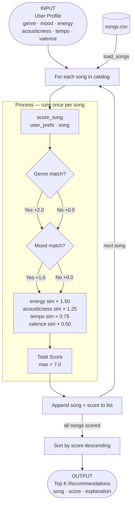

# 🎵 Music Recommender Simulation

## Project Summary

In this project you will build and explain a small music recommender system.

Your goal is to:

- Represent songs and a user "taste profile" as data
- Design a scoring rule that turns that data into recommendations
- Evaluate what your system gets right and wrong
- Reflect on how this mirrors real world AI recommenders

This simulation builds a small content-based music recommender using a 10-song catalog. Given a user's taste profile (preferred genre, mood, and numeric feature values), the system scores every song by measuring how closely its attributes match the user's preferences, then ranks and returns the top matches. Unlike collaborative filtering — which relies on what millions of other users listened to — this version works entirely from the song's own data, making its logic transparent and easy to inspect.

---

## How The System Works

Real-world recommenders like Spotify's Discover Weekly blend two strategies: collaborative filtering (finding users with similar listening histories) and content-based filtering (matching a song's measurable attributes to a listener's taste). This simulation focuses on content-based filtering because it works without any user history — the system only needs to know what a song sounds like and what the user prefers. The priority is transparency: every recommendation score is explainable as a weighted sum of feature similarities, so it is easy to see exactly why a song was or was not recommended.

### `Song` Object Features

Each song in the catalog stores the following attributes:

| Feature | Type | Role |
|---|---|---|
| `id` | int | Unique identifier |
| `title` | str | Display name |
| `artist` | str | Display name |
| `genre` | str (categorical) | Broad style label — one-hot encoded for scoring |
| `mood` | str (categorical) | Emotional tone — one-hot encoded for scoring |
| `energy` | float (0–1) | Intensity level; primary cluster separator |
| `tempo_bpm` | float (normalized) | Activity context; normalized to 0–1 before scoring |
| `valence` | float (0–1) | Musical positivity / emotional brightness |
| `danceability` | float (0–1) | Rhythmic feel |
| `acousticness` | float (0–1) | Organic vs. electronic texture |

### `UserProfile` Object Features

The user profile mirrors the song feature space so direct comparison is possible:

| Feature | Type | Role |
|---|---|---|
| `preferred_genre` | str | Matched categorically against each song's genre |
| `preferred_mood` | str | Matched categorically against each song's mood |
| `energy` | float (0–1) | User's preferred energy level |
| `tempo_bpm` | float | User's preferred tempo (normalized before scoring) |
| `valence` | float (0–1) | User's preferred emotional tone |
| `acousticness` | float (0–1) | User's preference for acoustic vs. electronic sound |

### Algorithm Recipe

#### Scoring Rule (one song — max 7.0 points)

Each song is scored against the user profile using flat categorical bonuses plus weighted numeric similarity. Numeric similarity for each feature uses `1 - |user_target - song_value|`, so a perfect match scores 1.0 and the furthest possible mismatch scores 0.0. Tempo is normalized to a 0–1 range before the difference is computed (divided by 200).

| Rule | Points | Why |
|---|---|---|
| Genre match | +2.0 flat | Strongest broad-style signal; anchors the recommendation |
| Mood match | +1.0 flat | Cross-genre emotional intent; separates chill lofi from focused lofi |
| Energy similarity | × 1.50 | Best cluster separator — largest spread in the dataset |
| Acousticness similarity | × 1.25 | Near-inverse of energy; reinforces the chill vs. intense axis |
| Tempo similarity | × 0.75 | Activity context (workout vs. study session) |
| Valence similarity | × 0.50 | Emotional color; useful but less decisive in a small catalog |

#### Ranking Rule (full catalog)

1. Run the Scoring Rule for every song in the catalog against the user profile
2. Collect all `(song, score, explanation)` tuples
3. Sort descending by score
4. Return the top K results (default: 5)

#### Data Flow



### Potential Biases

- **Genre over-prioritization** — At +2.0 points, a genre match alone outweighs any single numeric feature. A blues song with a perfect energy match to the user will still lose to a lofi song with a mediocre energy match if the user's genre is lofi. Great songs in neighboring genres (jazz, folk) may be ranked unfairly low.
- **Mood blind spot** — Mood is only worth +1.0, so two songs with identical numeric profiles but different moods receive very similar scores. A "focused" lofi track and a "chill" lofi track look almost the same to this system.
- **Small catalog amplifies gaps** — With 18 songs, some genres appear only once (e.g., metal, blues). A user who prefers metal will never get a genre-match bonus on 17 of 18 songs, making genre match practically useless for them while it heavily rewards pop/lofi users.
- **No listening history** — The system cannot learn. It gives the same recommendations regardless of how many times a user has already heard those songs.

---

## Sample Terminal Output

Running `python src/main.py` with 3 core profiles + 3 adversarial edge cases:

### Profile 1 — High-Energy Pop
```
  #1  Sunrise City — Neon Echo       Genre: pop     | Mood: happy    | Score: 6.74 / 7.00
  #2  Gym Hero — Max Pulse           Genre: pop     | Mood: intense  | Score: 5.84 / 7.00
  #3  Rooftop Lights — Indigo Parade Genre: indie pop| Mood: happy   | Score: 4.44 / 7.00
  #4  Neon Carnival — Prism Kids     Genre: electronic| Mood: euphoric| Score: 3.94 / 7.00
  #5  Drop Everything — Bass Theory  Genre: edm     | Mood: euphoric | Score: 3.75 / 7.00
```

### Profile 2 — Chill Lofi
```
  #1  Library Rain — Paper Lanterns  Genre: lofi    | Mood: chill    | Score: 6.86 / 7.00
  #2  Midnight Coding — LoRoom       Genre: lofi    | Mood: chill    | Score: 6.81 / 7.00
  #3  Focus Flow — LoRoom            Genre: lofi    | Mood: focused  | Score: 5.92 / 7.00
  #4  Spacewalk Thoughts — Orbit Bloom Genre: ambient| Mood: chill   | Score: 4.61 / 7.00
  #5  Rainy Season — Blue Ember      Genre: blues   | Mood: sad      | Score: 3.77 / 7.00
```

### Profile 3 — Deep Intense Rock
```
  #1  Storm Runner — Voltline        Genre: rock    | Mood: intense  | Score: 6.83 / 7.00
  #2  Gym Hero — Max Pulse           Genre: pop     | Mood: intense  | Score: 4.70 / 7.00
  #3  Shattered Glass — Iron Cult    Genre: metal   | Mood: angry    | Score: 3.82 / 7.00
  #4  Drop Everything — Bass Theory  Genre: edm     | Mood: euphoric | Score: 3.64 / 7.00
  #5  Neon Carnival — Prism Kids     Genre: electronic| Mood: euphoric| Score: 3.53 / 7.00
```

### EDGE 1 — Conflicting Preferences (high energy + sad mood)
```
  #1  Rainy Season — Blue Ember      Genre: blues   | Mood: sad      | Score: 5.11 / 7.00
  #2  Broken Streetlight — Hollow Crown Genre: hip-hop| Mood: sad    | Score: 4.38 / 7.00
  #3  Storm Runner — Voltline        Genre: rock    | Mood: intense  | Score: 3.80 / 7.00
  #4  Shattered Glass — Iron Cult    Genre: metal   | Mood: angry    | Score: 3.76 / 7.00
  #5  Gym Hero — Max Pulse           Genre: pop     | Mood: intense  | Score: 3.58 / 7.00
```
> Observation: Genre+mood bonus locks in Rainy Season at #1 despite its energy (0.39) being far from the target (0.90). The +3.0 categorical bonus overpowers the numeric mismatch.

### EDGE 2 — Genre Orphan (metal — only 1 song in catalog)
```
  #1  Shattered Glass — Iron Cult    Genre: metal   | Mood: angry    | Score: 7.00 / 7.00
  #2  Storm Runner — Voltline        Genre: rock    | Mood: intense  | Score: 3.70 / 7.00
  #3  Gym Hero — Max Pulse           Genre: pop     | Mood: intense  | Score: 3.52 / 7.00
  #4  Drop Everything — Bass Theory  Genre: edm     | Mood: euphoric | Score: 3.49 / 7.00
  #5  Neon Carnival — Prism Kids     Genre: electronic| Mood: euphoric| Score: 3.40 / 7.00
```
> Observation: Perfect 7.00/7.00 for #1, then a massive drop to 3.70 for #2. Only one metal song means no meaningful variety — a real catalog weakness.

### EDGE 3 — All-Middle (no strong preference, 0.5 everything)
```
  #1  Coffee Shop Stories — Slow Stereo Genre: jazz | Mood: relaxed  | Score: 6.17 / 7.00
  #2  Sunday Letters — Clara Vane     Genre: r&b    | Mood: romantic | Score: 3.71 / 7.00
  #3  Midnight Coding — LoRoom        Genre: lofi   | Mood: chill    | Score: 3.50 / 7.00
  #4  Focus Flow — LoRoom             Genre: lofi   | Mood: focused  | Score: 3.38 / 7.00
  #5  Golden Fields — River Moss      Genre: country| Mood: nostalgic| Score: 3.38 / 7.00
```
> Observation: Jazz wins easily because genre+mood both match. The +3.0 bonus inflates its score even though its numeric features aren't particularly close to 0.5.

---

## Getting Started

### Setup

1. Create a virtual environment (optional but recommended):

   ```bash
   python -m venv .venv
   source .venv/bin/activate      # Mac or Linux
   .venv\Scripts\activate         # Windows

2. Install dependencies

```bash
pip install -r requirements.txt
```

3. Run the app:

```bash
python -m src.main
```

### Running Tests

Run the starter tests with:

```bash
pytest
```

You can add more tests in `tests/test_recommender.py`.

---

## Experiments You Tried

Use this section to document the experiments you ran. For example:

- What happened when you changed the weight on genre from 2.0 to 0.5
- What happened when you added tempo or valence to the score
- How did your system behave for different types of users

---

## Limitations and Risks

Summarize some limitations of your recommender.

Examples:

- It only works on a tiny catalog
- It does not understand lyrics or language
- It might over favor one genre or mood

You will go deeper on this in your model card.

---

## Reflection

Read and complete `model_card.md`:

[**Model Card**](model_card.md)

Write 1 to 2 paragraphs here about what you learned:

- about how recommenders turn data into predictions
- about where bias or unfairness could show up in systems like this


---

## 7. `model_card_template.md`

Combines reflection and model card framing from the Module 3 guidance. :contentReference[oaicite:2]{index=2}  

```markdown
# 🎧 Model Card - Music Recommender Simulation

## 1. Model Name

Give your recommender a name, for example:

> VibeFinder 1.0

---

## 2. Intended Use

- What is this system trying to do
- Who is it for

Example:

> This model suggests 3 to 5 songs from a small catalog based on a user's preferred genre, mood, and energy level. It is for classroom exploration only, not for real users.

---

## 3. How It Works (Short Explanation)

Describe your scoring logic in plain language.

- What features of each song does it consider
- What information about the user does it use
- How does it turn those into a number

Try to avoid code in this section, treat it like an explanation to a non programmer.

---

## 4. Data

Describe your dataset.

- How many songs are in `data/songs.csv`
- Did you add or remove any songs
- What kinds of genres or moods are represented
- Whose taste does this data mostly reflect

---

## 5. Strengths

Where does your recommender work well

You can think about:
- Situations where the top results "felt right"
- Particular user profiles it served well
- Simplicity or transparency benefits

---

## 6. Limitations and Bias

Where does your recommender struggle

Some prompts:
- Does it ignore some genres or moods
- Does it treat all users as if they have the same taste shape
- Is it biased toward high energy or one genre by default
- How could this be unfair if used in a real product

---

## 7. Evaluation

How did you check your system

Examples:
- You tried multiple user profiles and wrote down whether the results matched your expectations
- You compared your simulation to what a real app like Spotify or YouTube tends to recommend
- You wrote tests for your scoring logic

You do not need a numeric metric, but if you used one, explain what it measures.

---

## 8. Future Work

If you had more time, how would you improve this recommender

Examples:

- Add support for multiple users and "group vibe" recommendations
- Balance diversity of songs instead of always picking the closest match
- Use more features, like tempo ranges or lyric themes

---

## 9. Personal Reflection

A few sentences about what you learned:

- What surprised you about how your system behaved
- How did building this change how you think about real music recommenders
- Where do you think human judgment still matters, even if the model seems "smart"

